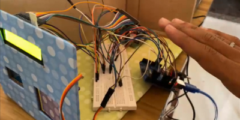
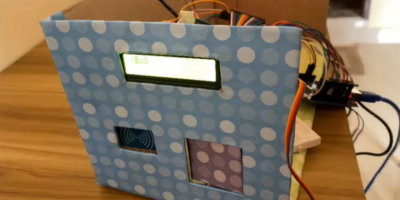
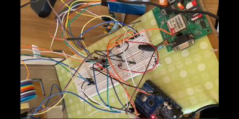
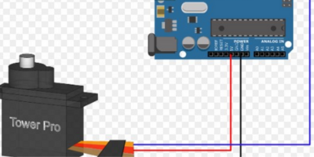
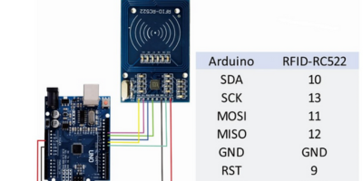
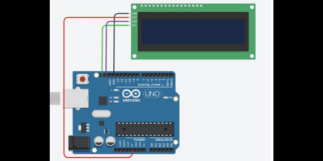
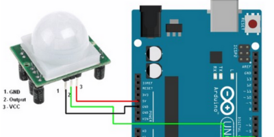
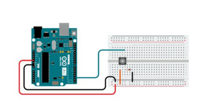

# Multi-layered Physical Access Control and Intrusion Detection System

## Model
Here are images of the actual model that was created:

## Abstract
This research studies the implementation of a multi-layered physical access control and intrusion detection system using RFID, GSM module, and PIR sensor technologies in a time when physical security is prioritized. By combining these modern elements, security is strengthened by many layers of defense. PIR sensors provide for quick intruder detection, GSM enables remote communication for real-time monitoring, and RFID assures safe entry. From planning to execution, the paper provides a thorough guide that delivers insightful information to organizations looking for a modern, efficient way to protect people, property, and data. This novel technique addresses the dynamic problems of the modern security landscape by improving security measures and enabling remote notifications.

## SWOT Analysis

### Strengths (S)
- **Enhanced Security Layers:** By integrating a GSM module for communication and a PIR sensor for motion detection, the system gains an additional layer of protection and becomes more resilient.
- **Real-Time Communication:** The inclusion of a GSM module enables real-time communication, allowing prompt notifications and responses to security events.
- **Comprehensive User Interface:** LCD and switch components contribute to a more comprehensive user interface, providing additional control options and visual feedback.

### Weaknesses (W)
- **Increasing Complexity:** Adding additional components may make the system more complex, necessitating careful planning and execution to keep it user-friendly. 
- **Increased Implementation Costs:** Adding a servo motor, GSM module, and PIR sensor could result in increased upfront expenses, which would affect budgetary constraints.

### Opportunities (O)
- **Advanced Automation:** By introducing regulated access, the servo motor enhances automation capabilities in particular situations.
- **Integration Potential:** By combining with additional automation systems and smart home technologies, the project's usefulness can be further increased.

### Threats (T)
- **Technological Dependencies:** The system's reliance on technology, particularly with the addition of new parts, puts it at risk for hazards arising from technological progress.
- **Market Competition:** With fast advancing technologies, the competitive nature of the security sector may make it difficult to win market share.

## Project Features
- **Multi-Layered Access Control:** With RFID cards, a PIR sensor for motion detection, and a servo motor for controlled entry, the project now provides improved access control.
- **Real-Time Infiltration Detection:** The PIR sensor enhances the system's proactive intrusion detection capabilities by helping to detect unauthorized movements in real time.
- **User-Friendly Interface:** By adding more control options and visual feedback, the LCD and switch components improve the user interface.
- **Thorough Logging:** The system can now deliver real-time notifications for prompt response in addition to scrupulously logging all access activities thanks to the integration of GSM connectivity.
- **Adaptability:** The project maintains its adaptability and flexibility, easily integrating additional parts and guaranteeing strong security for a range of applications.

## Design and Implementation Constraints

### Hardware Constraints
- Hardware limitations and compatibility may impact the choice of components and technologies for the system, with special attention to PIR sensor, GSM module, and servo motor compatibility.
- The choice of hardware components may be influenced by budgetary considerations, necessitating a compromise between price and functionality.

### User Requirements
- Meeting user expectations and ensuring user-friendliness can be constraints that affect the system's design and features.
- In order to ensure that users are comfortable with PIR sensor inputs, GSM connectivity, and servo motor-controlled access, user training and adoption times should take the additional functionality into account.

### Scalability and Performance Constraints
- The need to accommodate a growing number of users and devices and the requirement for real-time response to security events can impose constraints on system scalability and performance.
- Real-time response to security events, now including PIR sensor inputs, requires careful consideration of performance requirements.

## System Requirements

### User Interface
- The system should provide a user-friendly interface for authorized users to interact with using RFID cards and potentially PIR sensor inputs.
- The user interface should include visual feedback on an LCD screen, providing information about access status, alerts, and potentially PIR sensor detections.
- Audible feedback through a buzzer may be incorporated to enhance user experience, especially in scenarios where visual feedback may be limited.

### Software Interface
- The software should be compatible with the Arduino IDE, facilitating programming and development.
- Integration with sensor libraries, RFID libraries and GSM communication libraries is necessary to interface with hardware components effectively.
- Additional interfaces may be required for servo motor control, LCD display management, and switch inputs, ensuring comprehensive software support for all system components.

### Database Interface
- The system's database interface should handle storage and retrieval of access events, now including information from the PIR sensor and GSM communication logs.
- Compatibility with Excel or CSV file formats is essential for recording and analyzing access events and security-related data.

### Protocols
- The system may use communication protocols to transmit data, such as Serial communication for interfacing with Arduino components.
- Security protocols for data encryption and authentication should be implemented, especially when handling sensitive information such as GSM communication and access logs.

## Non-Functional Requirements

### Performance Requirements
The four fundamental needs are as follows:
- Provisioning and Authentication
- Configuration and Control
- Monitoring and Diagnostics
- Software Updates and Maintenance

### Software Quality Attributes

**Software Quality:**
- **Authentication Accuracy:** By minimizing false positives and negatives, the system has a high degree of accuracy in identifying users.
- **Usability:** The system is simple to use and straightforward, allowing authorized users to engage with it effectively.
- **Scalability:** As the system grows, the software is built to scale with more users and devices.

## Other Requirements
- Arduino IDE Setup
- 12V Constant Power Supply
- Storage for storing Logs
- GSM Module
- Servo Motor
- PIR Sensor
- LCD
- Switch

## Design Diagram

### Servo Motor connection With Arduino Uno

### RFID connection With Arduino Uno

### LCD connection With Arduino Uno

### PIR Sensor connection With Arduino Uno

### Switch Connection with Arduino Uno

